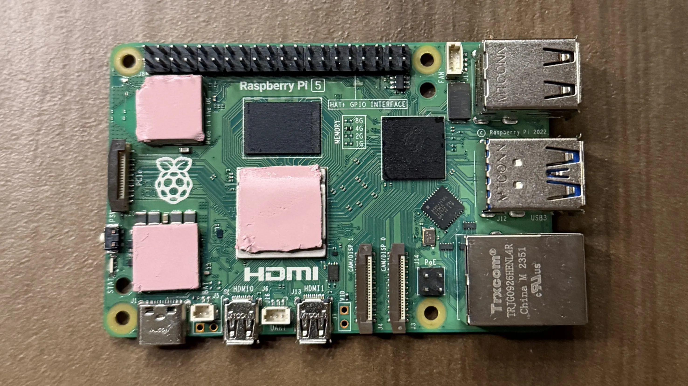
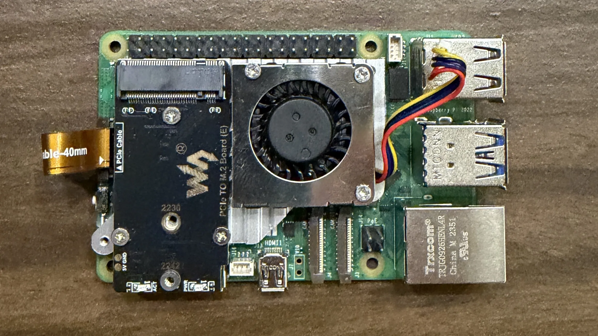
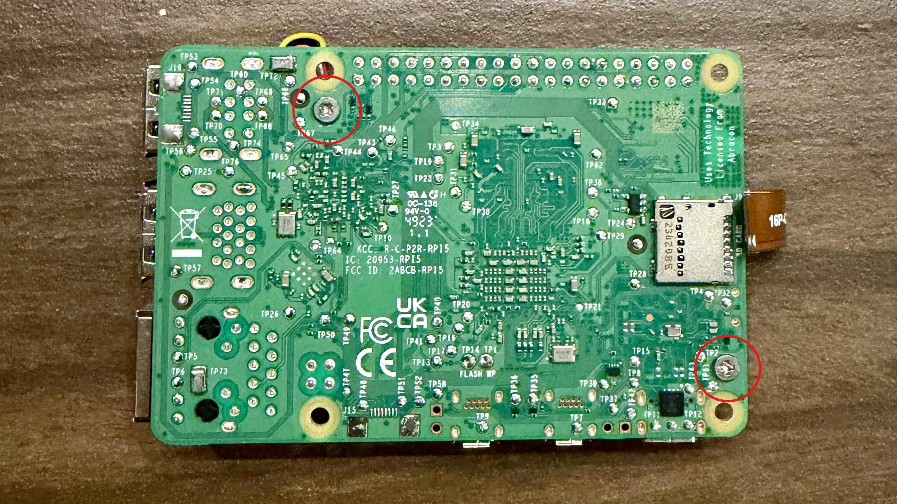
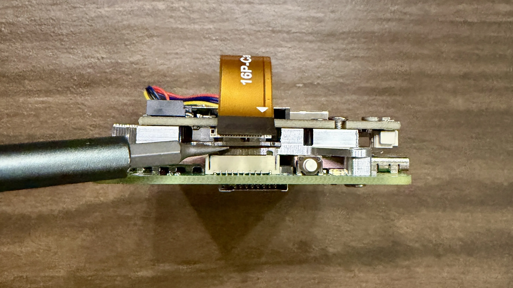
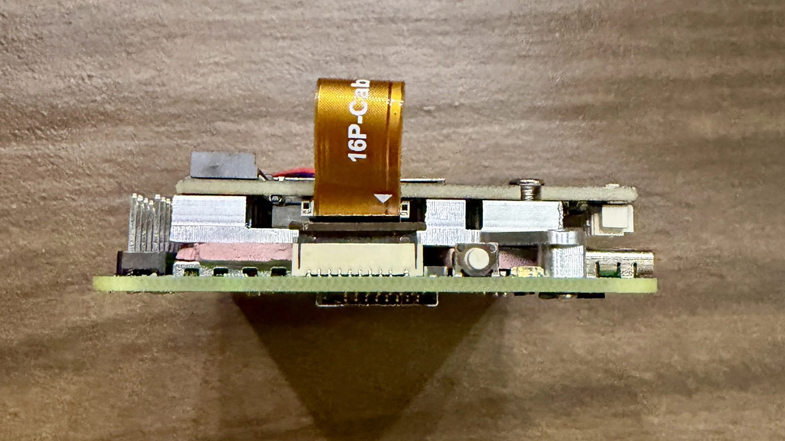
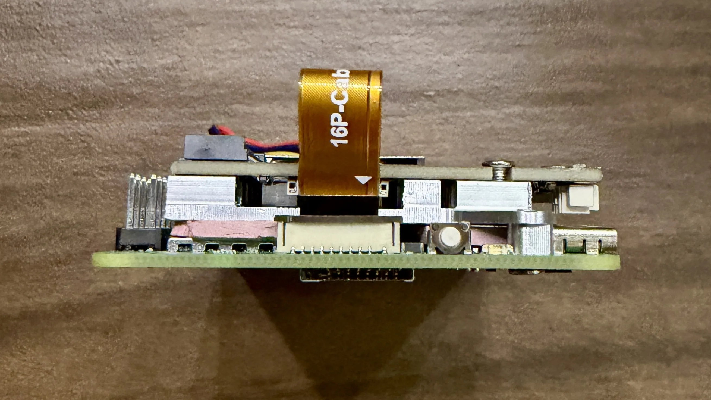
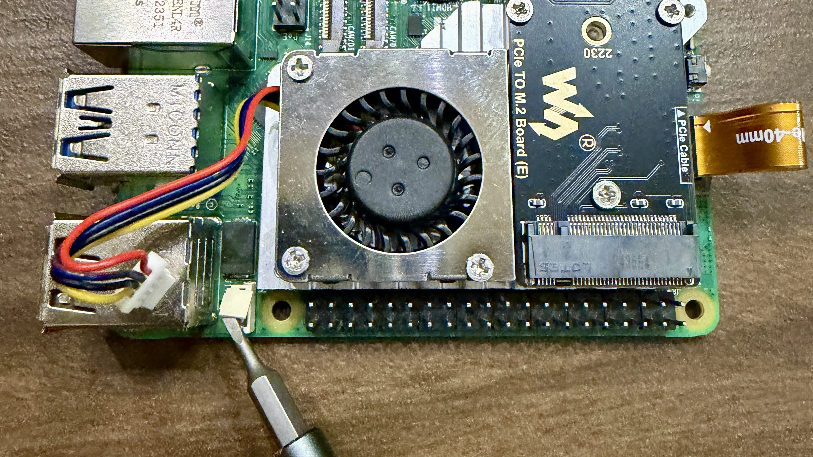
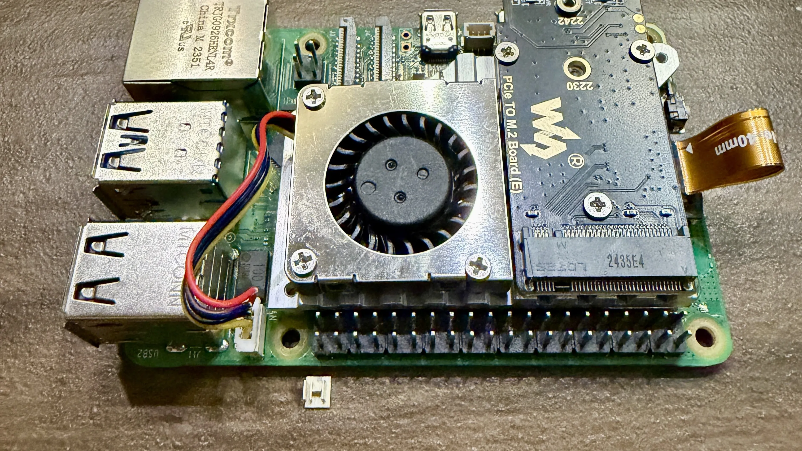
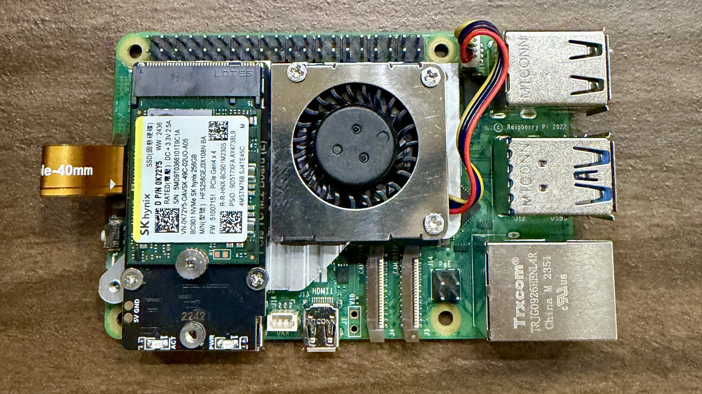

Follow this step-by-step guide to assemble your LibreCoach hardware. Take your time—proper assembly ensures reliable operation.

## Required Tools

- Phillips screwdriver (small)
- Wire strippers (thin gauge)
- Tweezers (helpful but not required)
- Clean, static-free workspace

## Step 1: Install Waveshare PCIe to M.2 Adapter (E)

### Apply Thermal Pads

1. Remove the thermal pads from the Waveshare PCIe to M.2 Adapter (E) packaging
2. Remove the thin plastic backing from the thermal transfer pads and apply them to the CPU (central, largest chip), the PMIC (power management chip, bottom left), and the Wi-Fi module (right side). Use the thinner pads for the CPU and Wi-Fi, and the thicker pad for the PMIC.
   

### Mount PCIe adapter

3. Be sure to remove the thin plastic backing from the top of thermal pads first
4. Place the PCIe adapter on on the thermal pads
   
5. Align the PCIe adapter mounting holes on the bottom of the Raspberry Pi and secure with the included screws.
   

### Connect the PCIe Ribbon

5. Locate the PCIe connector on the Raspberry Pi
6. Gently lift the black clip to open the connector
   
7. Insert the ribbon cable from the Waveshare adapter
   
8. Press down the black clip to secure the ribbon
   
9. The other end should be connected to the Waveshare PCIe adapter

## Connect the Fan

10. The Raspberry Pi fan connector has a small plastic cover that must be removed. Gently remove the cover using tweezers etc.
    
11. Connect the fan cable to the fan connector on the Raspberry Pi
    

### Mount the NVME Drive

12. Insert your NVME drive into the M.2 slot on the Waveshare PCIe adapter at a 30-degree angle
13. Press down gently and secure with the included screw
    

## Install Case Standoffs

14. Insert brass standoffs into all 4 corners of the case
    

## Install the CAN HAT

### Configure the 120Ω Termination Jumpers

:::note[Important]
The CAN HAT has two jumpers for 120Ω termination resistors. Confirm they are both in the off position:
The image shows:

- **Left jumper**: Incorrect position (off)
- **Right jumper**: Correct position (resistor installed)
  
  :::

### Mount the CAN HAT

1. Carefully align the CAN HAT with the 40-pin GPIO header on the Raspberry Pi
2. Press down gently but firmly until fully seated

3. The HAT should sit flush on top of the standoffs

### Connect Power from PCIe Adapter

<!--  -->

1. Locate the power cable from the PCIe adapter
2. Connect it to the power input on the CAN HAT
3. This provides stable power to the CAN interface

## Step 6: Final Assembly

### Place Pi in Case

<!--  -->

1. Carefully lower the assembled Pi into the case
2. Align the mounting holes with the standoffs
3. Secure with screws through the CAN HAT into the standoffs

### Install Top Cover

<!--  -->

1. Place the top cover with installed heatsink/fan onto the case
2. Ensure the fan is oriented correctly (airflow direction)
3. Secure with the remaining screws

<!--  -->

## Step 7: Verify Assembly

Before powering on:

1. **Check all connections**:
   - PCIe ribbon cable secure
   - CAN HAT fully seated
   - Fan connected
   - Power cable from PCIe adapter to CAN HAT connected

2. **Verify jumper settings** on CAN HAT

3. **Inspect for loose screws or debris**

## What's Next?

Your hardware is now assembled! Continue to:

- [Software Installation](/build/software/) - Flash HAOS and install LibreCoach
- [Connect to your RV's CAN network](/build/installation/)

## Troubleshooting

### Pi won't boot

- Verify NVME is properly seated
- Check that PCIe ribbon cable is secure
- Ensure power supply is adequate (5V, 3A minimum)

### CAN HAT not detected

- Verify the HAT is fully seated on the GPIO header
- Check power cable connection from PCIe adapter
- Review jumper settings

### Overheating

- Ensure thermal pads are properly installed
- Verify fan is connected and spinning
- Check that heatsink makes contact with thermal pads

Need help? Ask on the [forum](https://forum.LibreCoach.com)!
